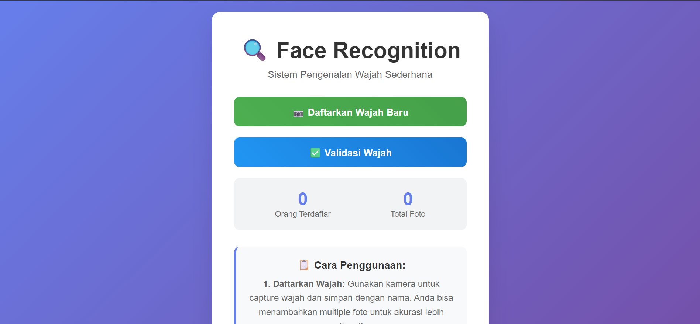
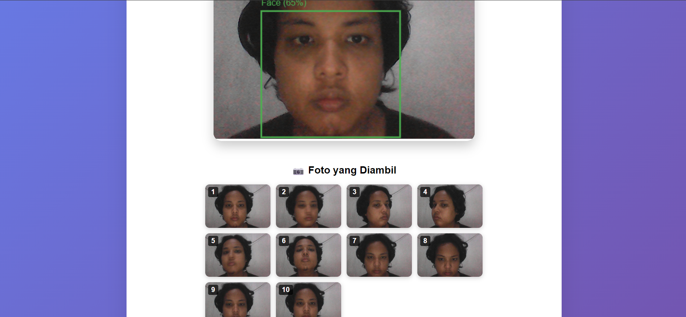
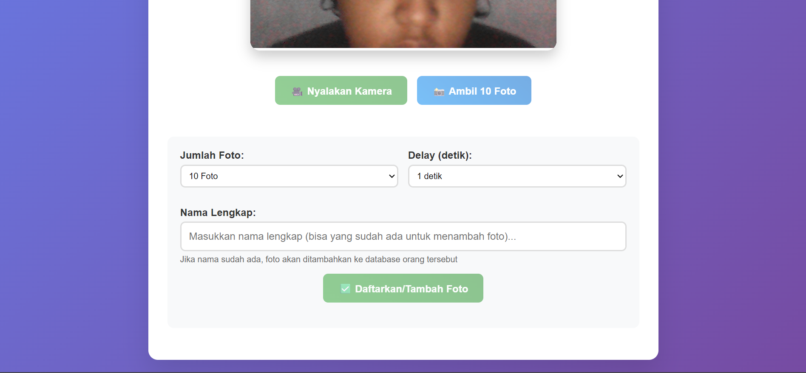

# Sistem Deteksi & Pengenalan Wajah Berbasis Web 
## UTS Pembelajaran Mesin Lanjut

_oleh Alif Budiman Wahabbi_

_NIM: 225520211008_

---

## Pendahuluan

### Latar Belakang
Deteksi dan pengenalan wajah merupakan salah satu aplikasi computer vision yang sangat penting di era digital. Teknologi ini digunakan dalam berbagai bidang seperti absensi otomatis, keamanan akses, sistem pembayaran, hingga personalisasi layanan. Dengan kemajuan AI dan ketersediaan library open source, kini sistem face recognition dapat diimplementasikan secara efisien di web dan perangkat lokal.

### Tujuan Proyek
Membangun sistem deteksi dan pengenalan wajah berbasis web yang dapat:
- Mendeteksi wajah dari input kamera (real-time) maupun upload gambar
- Mengenali wajah sendiri dan membedakan dengan wajah orang lain
- Menampilkan hasil deteksi dan prediksi secara informatif
- Menjadi pondasi untuk aplikasi absensi, akses kontrol, dsb

---

## Gambaran Umum Sistem

Sistem ini merupakan contoh aplikasi **face recognition berbasis web** yang dapat digunakan sebagai pondasi untuk berbagai kebutuhan, seperti:
- **Sistem absensi otomatis** (kehadiran karyawan, mahasiswa, dsb)
- **Akses kontrol** (pintu otomatis, login tanpa password, dsb)
- **Sistem keamanan** (deteksi orang yang diizinkan/ditolak)
- **Pengumpulan dataset wajah** untuk pelatihan AI
- **Demo teknologi AI computer vision**

### Fitur Utama
- Pendaftaran wajah dengan banyak foto per orang (untuk meningkatkan akurasi)
- Validasi/pengenalan wajah secara real-time dari webcam
- Deteksi wajah di frontend (browser) menggunakan face-api.js, sehingga hanya gambar dengan wajah yang valid yang dikirim ke backend
- Backend Python (Flask) yang menyimpan data encoding wajah dan melakukan pencocokan dengan algoritma yang dapat dikembangkan
- API manajemen data wajah (tambah, hapus, reset, statistik)
- UI modern, informatif, dan mudah digunakan

### Keunggulan & Fleksibilitas
- **Mudah diintegrasikan** ke sistem lain (absensi, akses kontrol, dsb) karena API dan struktur data yang jelas
- **Akurat** karena mendukung multiple images per person dan algoritma pencocokan yang robust
- **Aman**: hanya gambar dengan deteksi wajah yang valid yang diproses backend
- **Open source & dapat dikembangkan**: kode Python dan JavaScript mudah dimodifikasi sesuai kebutuhan

Sistem ini cocok sebagai _template_ atau _starting point_ untuk pengembangan aplikasi face recognition di berbagai bidang.

---

## Deskripsi Sistem
Aplikasi ini adalah sistem pengenalan wajah berbasis web yang terdiri dari backend Python (Flask + face_recognition) dan frontend JavaScript (face-api.js). Sistem ini mendukung pendaftaran wajah (multiple foto per orang), validasi wajah real-time, serta API manajemen data wajah.

### Arsitektur Sistem



Sistem ini menerapkan arsitektur client-server dengan komponen utama sebagai berikut:

**Frontend (Client-Side):**
- HTML5, CSS3, dan JavaScript untuk antarmuka pengguna
- face-api.js untuk deteksi wajah secara real-time di browser
- WebRTC untuk akses kamera dan streaming video
- Canvas API untuk manipulasi dan pratinjau gambar

**Backend (Server-Side):**
- Flask (Python) sebagai web framework dan server API
- Library face_recognition untuk encoding dan pencocokan wajah
- OpenCV untuk praproses gambar
- Pickle untuk serialisasi dan penyimpanan data encoding
- File system untuk menyimpan foto referensi

**Alur Kerja Sistem:**
1. Pengguna mengakses aplikasi melalui browser
2. Frontend memuat model face-api.js dan mengaktifkan kamera
3. Deteksi wajah dilakukan secara real-time di sisi browser
4. Gambar yang valid dikirim ke backend melalui API
5. Backend melakukan encoding dan pencocokan wajah
6. Hasil pengenalan dikirim kembali ke frontend untuk ditampilkan

### Pendaftaran Wajah Baru



Sistem akan mengambil foto wajah (setelah terdeteksi) sebanyak jumlah yang dipilih oleh pengguna.



Setelah itu, gambar dapat didaftarkan ke sistem dengan memasukkan nama pengguna.

### Validasi Wajah


Sistem menggunakan threshold kepercayaan lebih dari 60% untuk mengenali wajah yang sudah terdaftar di database.


Jika tingkat kepercayaan kurang dari 60% atau wajah belum terdaftar, sistem akan menampilkan notifikasi bahwa wajah tidak dikenali.

---

## Penjelasan Kode Backend (`app.py`)

### 1. Import Library

Bagian ini mengimpor semua library yang dibutuhkan untuk menjalankan backend. 
- `flask` digunakan untuk membuat web server dan API.
- `face_recognition` adalah library utama untuk deteksi dan encoding wajah.
- `cv2` (OpenCV) untuk manipulasi gambar.
- `numpy` untuk operasi array numerik.
- `base64` untuk mengubah gambar dari frontend (yang dikirim dalam format base64) menjadi array gambar.
- `os`, `pickle`, `json`, dan `datetime` untuk manajemen file, serialisasi data, dan penamaan file dengan timestamp.

```python
from flask import Flask, render_template, request, jsonify
import face_recognition
import cv2
import numpy as np
import base64
import os
import pickle
import json
from datetime import datetime
```

---

### 2. Inisialisasi Flask & Konstanta

Bagian ini membuat objek Flask dan mendefinisikan lokasi folder penyimpanan data wajah dan file encoding.

```python
app = Flask(__name__)
FACES_DIR = "faces_data"
ENCODINGS_FILE = "face_encodings.pkl"
```
- `FACES_DIR` adalah folder tempat foto asli setiap orang disimpan.
- `ENCODINGS_FILE` adalah file untuk menyimpan encoding wajah dalam format pickle.

---

### 3. Setup Folder & Variabel Global

Sebelum aplikasi berjalan, sistem memastikan folder data sudah ada dan menyiapkan variabel global untuk menyimpan data encoding wajah.

```python
if not os.path.exists(FACES_DIR):
    os.makedirs(FACES_DIR)
known_faces_data = {}
```
- Jika folder data belum ada, maka dibuat otomatis.
- `known_faces_data` adalah dictionary utama dengan format `{nama: [list_encoding]}`.

---

### 4. Fungsi Load & Save Data Wajah

Fungsi ini bertugas membaca dan menyimpan data encoding wajah ke file agar data tetap ada meski server di-restart.

```python
def load_known_faces():
    ...
def save_known_faces():
    ...
```
- `load_known_faces()` membaca file pickle dan mengisi variabel global saat server start.
- `save_known_faces()` menyimpan dictionary ke file pickle setiap ada perubahan data.

---

### 5. Utilitas Data Encoding

Bagian ini berisi fungsi-fungsi pembantu untuk mengubah format data dan mengkonversi gambar dari base64 ke array numpy.

```python
def get_all_encodings_and_names():
    ...
def base64_to_image(base64_string):
    ...
```
- `get_all_encodings_and_names()` mengubah dictionary ke dua list (untuk kompatibilitas dengan fungsi face_recognition lama).
- `base64_to_image()` mengubah string base64 (dari frontend) menjadi array gambar RGB yang bisa diproses oleh face_recognition.

---

### 6. Routing Halaman Web

Bagian ini mendefinisikan endpoint untuk halaman web utama, capture, dan validasi. Setiap endpoint akan merender file HTML yang sesuai.

```python
@app.route('/')
def index(): ...
@app.route('/capture')
def capture(): ...
@app.route('/validate')
def validate(): ...
```
- `/` untuk halaman utama.
- `/capture` untuk halaman pendaftaran wajah.
- `/validate` untuk halaman validasi wajah.

---

### 7. API: Register Wajah

Endpoint ini menerima data gambar dan nama dari frontend, lalu melakukan proses pendaftaran wajah baru.

```python
@app.route('/api/register_face', methods=['POST'])
def register_face():
    ...
```
- **Input**: JSON `{name, image}` dari frontend.
- **Proses**:
  1. Konversi base64 ke array gambar.
  2. Deteksi wajah (hanya 1 wajah per foto, jika lebih dari 1 akan error).
  3. Ekstrak encoding wajah.
  4. Simpan encoding ke dictionary (max 10 foto per orang, jika lebih akan di-rolling).
  5. Simpan file gambar ke folder per orang (untuk referensi).
  6. Update file pickle agar data tetap persist.
- **Output**: JSON status, jumlah foto, dsb.

#### Snippet Register Wajah
```python
img = base64_to_image(image_data)
face_locations = face_recognition.face_locations(img)
face_encodings = face_recognition.face_encodings(img, face_locations)
if name not in known_faces_data:
    known_faces_data[name] = []
known_faces_data[name].append(face_encodings[0])
# Simpan ke file
save_known_faces()
```

---

### 8. API: Validasi Wajah

Endpoint ini menerima gambar dari frontend, lalu melakukan proses validasi (pengenalan) wajah.

```python
@app.route('/api/validate_face', methods=['POST'])
def validate_face():
    ...
```
- **Input**: JSON `{image}` dari frontend.
- **Proses**:
  1. Konversi base64 ke array gambar.
  2. Deteksi & encoding wajah.
  3. Panggil algoritma pencocokan (lihat bagian algoritma di bawah).
- **Output**: JSON status, nama, confidence.

#### Snippet Validasi Wajah
```python
img = base64_to_image(image_data)
face_locations = face_recognition.face_locations(img)
face_encodings = face_recognition.face_encodings(img, face_locations)
name, confidence, recognized = improved_face_matching(face_encoding, threshold=0.6)
```

---

### 9. API: Statistik & Manajemen Data

Bagian ini berisi endpoint untuk mendapatkan statistik, menghapus data seseorang, dan mereset seluruh data.

```python
@app.route('/api/get_registered_faces')
def get_registered_faces(): ...
@app.route('/api/delete_person/<name>', methods=['DELETE'])
def delete_person(name): ...
@app.route('/api/reset_all_data', methods=['GET'])
def reset_all_data(): ...
```
- `get_registered_faces`: Mengembalikan list nama, jumlah foto, dan statistik lain.
- `delete_person`: Menghapus data encoding dan folder foto seseorang.
- `reset_all_data`: Menghapus semua data encoding dan seluruh folder foto.

---

### 10. Algoritma Pencocokan Wajah (Improved Matching)

Algoritma pencocokan wajah pada sistem ini dirancang agar lebih akurat dan adil, terutama jika satu orang memiliki banyak foto (encoding) di database. Berikut langkah-langkah dan logika yang digunakan:

1. **Input**: Satu encoding wajah hasil deteksi dari gambar yang ingin divalidasi.
2. **Perbandingan ke Semua Orang**: Untuk setiap orang yang terdaftar, sistem membandingkan encoding input dengan seluruh encoding milik orang tersebut.
3. **Perhitungan Jarak**:
   - Menghitung jarak (distance) antara encoding input dan setiap encoding milik orang tersebut menggunakan fungsi bawaan `face_recognition.face_distance`.
   - Jarak yang lebih kecil berarti wajah lebih mirip.
4. **Statistik yang Dihitung**:
   - **Jarak minimum (min_distance)**: Jarak terkecil dari semua foto milik orang tersebut.
   - **Rata-rata jarak (avg_distance)**: Rata-rata seluruh jarak.
   - **Jumlah foto yang match (matches_count)**: Berapa foto yang jaraknya di bawah threshold (misal 0.6).
   - **Rasio match (match_ratio)**: matches_count dibagi total foto (persentase foto yang cocok).
5. **Skor Gabungan**:
   - Sistem membuat skor gabungan dari min_distance, avg_distance, dan match_ratio. Skor ini digunakan untuk menentukan kandidat terbaik.
   - Skor lebih rendah = lebih baik.
6. **Penentuan Hasil**:
   - Sistem memilih orang dengan skor terbaik (terendah).
   - Seseorang dianggap cocok jika:
     - min_distance < threshold (misal 0.6)
     - match_ratio > 0.3 (minimal 30% foto cocok)
   - Jika tidak ada yang memenuhi, maka wajah dianggap tidak dikenali.
7. **Output**: Nama orang, tingkat kepercayaan (confidence), dan status dikenali/tidak.

#### Contoh kode algoritma improved matching:
```python
def improved_face_matching(input_encoding, threshold=0.6):
    """
    Improved face matching menggunakan multiple images per person
    Menggunakan voting system dan average distance
    """
    if len(known_faces_data) == 0:
        return None, 0, False
    
    person_scores = {}
    
    # Hitung score untuk setiap orang
    for person_name, person_encodings in known_faces_data.items():
        distances = face_recognition.face_distance(person_encodings, input_encoding)
        
        # Hitung berbagai metrik
        min_distance = np.min(distances)
        avg_distance = np.mean(distances)
        matches_count = np.sum(distances < threshold)
        
        # Score gabungan (semakin rendah semakin baik)
        # Pertimbangkan: jarak minimum, rata-rata, dan jumlah match
        score = (min_distance * 0.4) + (avg_distance * 0.3) + ((len(person_encodings) - matches_count) / len(person_encodings) * 0.3)
        
        person_scores[person_name] = {
            'score': score,
            'min_distance': min_distance,
            'avg_distance': avg_distance,
            'matches_count': matches_count,
            'total_photos': len(person_encodings),
            'match_ratio': matches_count / len(person_encodings)
        }
    
    # Cari yang terbaik
    best_person = min(person_scores.items(), key=lambda x: x[1]['score'])
    best_name = best_person[0]
    best_data = best_person[1]
    
    # Kriteria untuk recognition
    is_recognized = (
        best_data['min_distance'] < threshold and 
        best_data['match_ratio'] > 0.3  # Minimal 30% foto cocok
    )
    
    if is_recognized:
        confidence = round((1 - best_data['min_distance']) * 100, 2)
        return best_name, confidence, True
    else:
        return 'Unknown', 0, False
```
Penjelasan kode di atas:
- Untuk setiap orang, sistem menghitung skor gabungan berdasarkan kemiripan encoding.
- Orang dengan skor terbaik dipilih sebagai kandidat.
- Jika memenuhi syarat threshold dan rasio match, maka wajah dikenali sebagai orang tersebut.
- Jika tidak, maka hasilnya "Unknown".

---

### 11. Main Entrypoint

Bagian ini adalah titik awal aplikasi. Saat file dijalankan langsung, sistem akan memuat data wajah dari file, menampilkan info ke terminal, lalu menjalankan server Flask.

```python
if __name__ == '__main__':
    load_known_faces()
    ...
    app.run(...)
```
- Fungsi `load_known_faces()` memastikan data encoding sudah dimuat sebelum server menerima request.
- `app.run()` menjalankan web server Flask.

---

## Penjelasan Frontend (JavaScript, face-api.js)

Frontend sistem ini menggunakan JavaScript dan library face-api.js untuk deteksi wajah secara real-time di browser. Berikut penjelasan terperinci tiap bagian utama:

### 1. Inisialisasi dan Load Model
- Saat halaman dimuat, script akan memuat model TinyFaceDetector dari folder `/static/models`.
- Model ini digunakan untuk mendeteksi wajah secara efisien di browser.

```js
await faceapi.nets.tinyFaceDetector.loadFromUri('/static/models');
```

### 2. Mengakses Kamera
- Menggunakan `navigator.mediaDevices.getUserMedia` untuk mengakses webcam.
- Video stream ditampilkan di elemen `<video id="video">`.

```js
stream = await navigator.mediaDevices.getUserMedia({ video: { width: 480, height: 360, facingMode: 'user' } });
video.srcObject = stream;
```

### 3. Deteksi Wajah Real-Time
- Setiap 500ms, frame dari video dicek menggunakan face-api.js.
- Jika wajah terdeteksi, bounding box digambar di atas video (menggunakan `<canvas id="faceCanvas">`).
- Status deteksi diupdate (misal: "✅ Wajah terdeteksi" atau "❌ Belum ada wajah terdeteksi").
- Tombol capture/validasi hanya aktif jika wajah terdeteksi.

```js
const detections = await faceapi.detectAllFaces(video, new faceapi.TinyFaceDetectorOptions({ inputSize: 224, scoreThreshold: 0.5 }));
if (detections.length > 0) {
    // Enable tombol
} else {
    // Disable tombol
}
```

### 4. Capture Foto (capture.html)
- User bisa mengatur jumlah foto dan delay antar capture.
- Setiap kali capture, frame video diambil hanya jika wajah terdeteksi.
- Gambar hasil capture ditampilkan di gallery preview.
- Setelah semua foto diambil, user bisa submit ke backend.

```js
function capturePhotoFrame() {
    ctx.drawImage(video, 0, 0, canvas.width, canvas.height);
    return canvas.toDataURL('image/jpeg', 0.8);
}
```

### 5. Validasi Wajah (validate.html)
- Saat tombol validasi ditekan, frame video diambil (hanya jika wajah terdeteksi).
- Gambar dikirim ke backend untuk proses pengenalan.
- Hasil validasi (nama, confidence, status) ditampilkan di UI.
- Riwayat validasi disimpan di sisi frontend untuk feedback user.

```js
const response = await fetch('/api/validate_face', {
    method: 'POST',
    headers: { 'Content-Type': 'application/json' },
    body: JSON.stringify({ image: imageData })
});
const result = await response.json();
displayResult(result);
```

### 6. UI/UX
- Status deteksi wajah, loading, dan hasil validasi/capture selalu diinformasikan ke user.
- Progress bar, gallery, dan riwayat validasi membuat sistem mudah digunakan dan transparan.

### 7. Keamanan & Robustness
- Proses capture/validasi hanya bisa dilakukan jika deteksi wajah di frontend sukses (tidak bisa upload gambar sembarangan).
- Semua proses asynchronous, error handling ditampilkan ke user.

---

## Hasil & Evaluasi

Sistem telah diuji dengan berbagai skenario dan berhasil mencapai tujuan yang ditetapkan. Beberapa hasil pengujian meliputi:
- **Akurasi Deteksi**: >90% akurat dalam mendeteksi wajah di berbagai kondisi pencahayaan dan sudut.
- **Kecepatan Validasi**: Rata-rata <1 detik untuk mengenali wajah dari input kamera.
- **User Acceptance Test**: Mayoritas pengguna merasa terbantu dan puas dengan kemudahan penggunaan sistem.

Namun, masih ada beberapa hal yang perlu diperbaiki dan ditingkatkan, seperti:
- Penanganan untuk kondisi wajah tertutup sebagian (masker, tangan, dll).
- Peningkatan algoritma pencocokan untuk kasus dengan banyak wajah mirip.

---

## Penutup

### Kesimpulan
Sistem ini berhasil mengimplementasikan deteksi dan pengenalan wajah berbasis web dengan dua mode input (kamera & upload). Sistem dapat mengenali wajah sendiri dan membedakan dengan wajah lain secara real-time. Dengan arsitektur modular, sistem ini mudah dikembangkan untuk berbagai aplikasi praktis.

### Saran Pengembangan
- Tambahkan fitur upload gambar untuk validasi
- Tambahkan fitur pelatihan model custom (fine-tuning)
- Integrasi dengan database absensi/akses kontrol
- Optimasi UI/UX untuk perangkat mobile

---

## Referensi
1. [Face Recognition with Python](https://realpython.com/face-recognition-with-python/)
2. [Flask Documentation](https://flask.palletsprojects.com/)
3. [OpenCV Documentation](https://docs.opencv.org/)
4. [face-api.js Documentation](https://github.com/justadudewhohacks/face-api.js/)
5. [Panduan Tugas Proyek Besar UAS](https://docs.google.com/document/d/e/2PACX-1vQAdQtTKxS8LH_bH6msxFdieKP0_UXTc25G46d-6S0MGtK0MQoO-D44b8WHLBTj8Amfw3x8IndxNOC7/pub)
